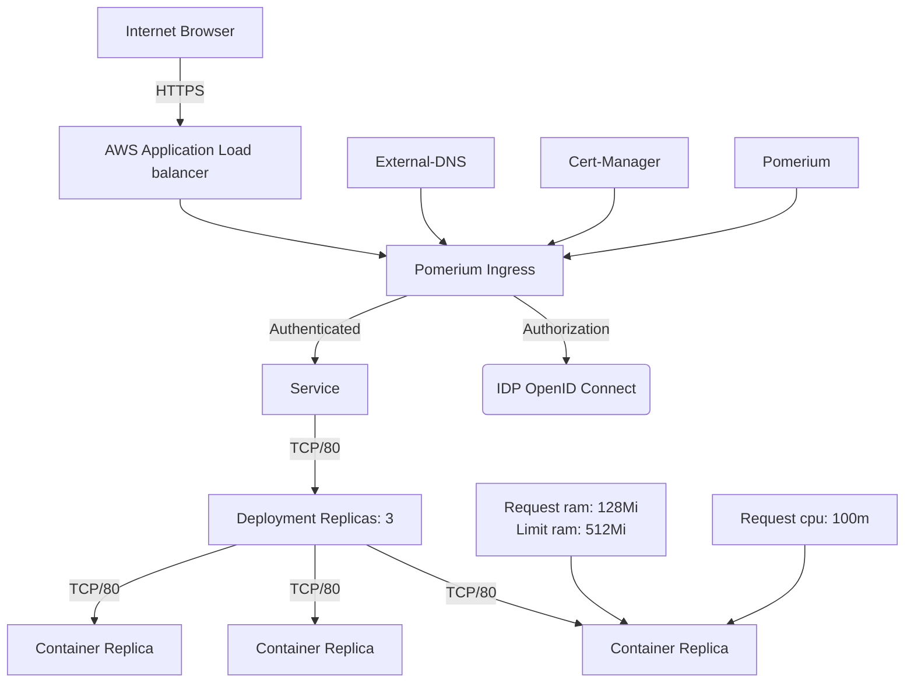

# Kubernetes Overview

This is how a very simple kubernetes deployment is setup, this is ver basic and does not include any advanced features like autoscaling, monitoring, logging, etc.



#### All the yaml

Here you can see all the yaml files that are needed to deploy the above setup.

=== "Namespace"
    ```yaml
    ---
    apiVersion: v1
    kind: Namespace
    metadata:
      name: handbook
    ```

=== "Deployment"
    ```yaml
    ---
    apiVersion: apps/v1
    kind: Deployment
    metadata:
      name: handbook
      namespace: handbook
    spec:
      replicas: 1
      selector:
        matchLabels:
          app: handbook
      strategy:
        type: RollingUpdate
        maxSurge: 1
        maxUnavailable: 1
      template:
        metadata:
          labels:
            app: handbook
        spec:
          containers:
            - name: handbook
              image: 362898812976.dkr.ecr.eu-west-1.amazonaws.com/handbook:1681287728 # {"$imagepolicy": "handbook:handbook-imagepolicy"}
              ports:
                - containerPort: 80
              env:
                - name: PORT
                  value: "80"
              resources:
                requests:
                  cpu: 100m
                  memory: 128Mi
                limits:
                  memory: 512Mi
              redinessProbe:
                httpGet:
                  path: /
                  port: 80
                initialDelaySeconds: 10
                periodSeconds: 10
              livenessProbe:
                httpGet:
                  path: /
                  port: 80
                initialDelaySeconds: 10
                periodSeconds: 10
    ```
=== "Service"
    ```yaml
    ---
    apiVersion: v1
    kind: Service
    metadata:
      name: handbook
      namespace: handbook
    spec:
      selector:
        app: handbook
      ports:
        - protocol: TCP
          port: 80
          targetPort: 80
      type: ClusterIP
    ```
=== "Ingress"
    ```yaml
    ---
    apiVersion: networking.k8s.io/v1
    kind: Ingress
    metadata:
      name: handbook-ingress
      namespace: handbook
      annotations:
        cert-manager.io/cluster-issuer: zerossl-prod
        external-dns.alpha.kubernetes.io/hostname: handbook.aws.agilemail.online
        ingress.pomerium.io/allowed_domains: |
          - postnord.com
        ingress.pomerium.io/pass_identity_headers: "false"
    spec:
      ingressClassName: pomerium
      tls:
        - hosts:
            - handbook.aws.agilemail.online
          secretName: handbook-tls
      rules:
      - host: handbook.aws.agilemail.online
        http:
          paths:
          - path: /
            pathType: Prefix
            backend:
              service:
                name: handbook
                port:
                  number: 80
    ```